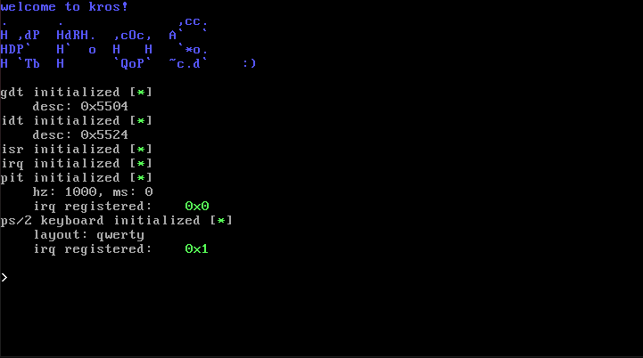

# kros
### January 19 16:12 UTC

We're back in business baby!
This is a very simple x86 Ring 0 OS. It's end goal is to be more of an abstraction layer for me when I make low-level games.

Current state:

## Roadmap

### Implemented:

- GDT
- IDT
- ISRs
- PIC and IRQs
- PIT timer
- PS/2 keyboard driver

### Up next:

- virtio driver
- PCI driver
- Bitmap allocator
- Disk driver
- Filesystem of some sort
